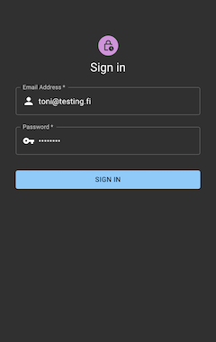
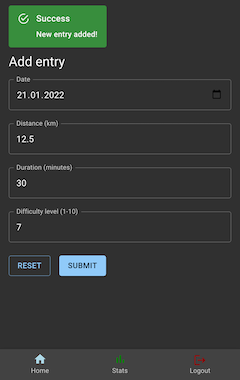
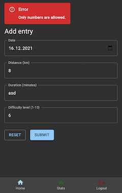
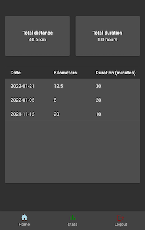

# Fitlogger

Full stack project for personal use.

App for logging cycling sessions to a database. Stat page for viewing basic info such as total distance and total time spent cycling. Entries can be removed from the database. Support for multiple users.

Working demo with a test database:
https://f1tlogger.herokuapp.com/

User: test@testing.com  
Password: heroku123!

More specific READMEs can be found in backend and frontend folders.

# Main frameworks and libraries used
## Backend
- TypeScript
- Node
- Express
- Mongo
- JWT
- bcrypt
- Jest

## Frontend
- React
- React router
- Redux (I recognize that Redux is not needed in a project this small. It was used mainly for learning purposes. :) )
- Material UI
- Axios
- Cypress

# Screenshots

# :construction: TO DO :construction:

- :white_check_mark: *Allow commas to be inputted and transform them to dots.*
- Show error notification or logout the user if token is expired.